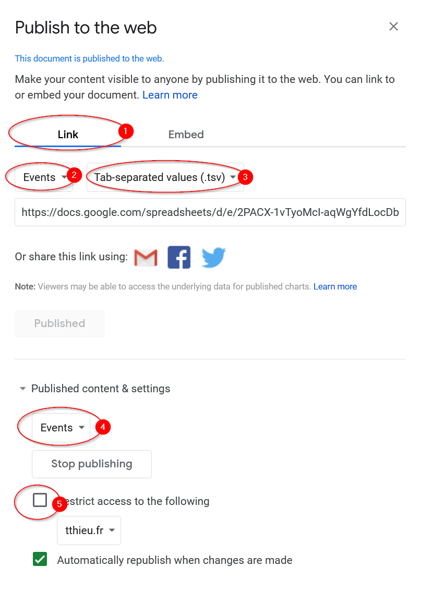

# wwww.citizenbar.fr

Frontend pour le site du bar

Géré avec [hugo](https://gohugo.io)

## Deploiement sur sourcehut

```
# deploiement à la demande
make deploy

# deploiement continue
git push origin   # <-- utilise le .build.yml
```

Sourcehut impose une CSP très restrictif empêchant d'inclure des ressources externes dans les pages

## Deploiement sur netlify

On veut donc aussi pouvoir déployer sur netlify (pour la prod par exemple)

```
# deploiement continue
git push gh       # <-- utilise le netlify.toml
```

## Database

La base de donnée du site est un tableur sur Google Sheet nommé [Citizen Database](https://docs.google.com/spreadsheets/d/13gr_L-7bk4itlpC4wqGOgOHOHmj3F4KtdoN041lTX8s/edit)

Chaque onglet est publié sur le web en format tsv _("tab-separated values")_

`File -> Publish to the Web -> Link (tab)`



## Cache

Le cache de firefox peut créer des problèmes de debug

```
(1) about:config
(2) browser.cache.disk.enable => false
(3) browser.cache.memory.enable => false
```
